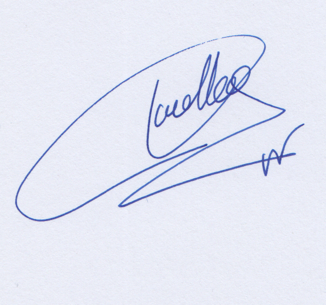

# Siamese Signature Verificator
## Deep Siamese Inception Neural Network for Off-Line Signature Verification

This repository presents a Siamese Neural Networks to help solving the off-line signature verification problem against random forgeries. 

Our solution is writer-independent, and it can be used on new signers without any additional training. 

For example, our solution can verify that the three first signtures belong to one signer, and the other two signtures belong to other signers.


    

We tested our approach on the SigComp11 dataset and achieved 4% of ERR in verification which demonstrates the generalization capabilities of our proposal. However, this is a preliminary version of our software. If you want our best version write us to jose.velez#urjc.es.

## Installation

```
pip install -r requirements.txt

python verification_server.py
```

## Test the system working

Using this [link](http://193.147.52.134:9002/) you can test the system working. To do that, first you have to create two PNG images with the signatures to be compared, or download from out sample directory.

## License

You are free to:

Share — copy and redistribute the material in any medium or format

Adapt — remix, transform, and build upon the material 

Under the following terms:

Attribution — You must give appropriate credit, provide a link to the license, and indicate if changes were made. You may do so in any reasonable manner, but not in any way that suggests the licensor endorses you or your use.

NonCommercial — You may not use the material for commercial purposes.

No additional restrictions — You may not apply legal terms or technological measures that legally restrict others from doing anything the license permits.

